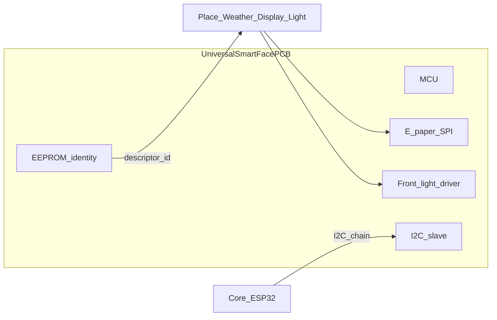

# Universal smart-face platform

Production target: **one foundational PCB** for Place, Weather, Display, Light, and future face-bearing cubes. The EEPROM descriptor (same model as [m6-e2e-london-weather-light.md](m6-e2e-london-weather-light.md)) selects the personality; e-ink shows bound state; front-light provides illumination output.

**M6 breadboard path** (passive EEPROM + separate Light LED) remains the first electronics sprint — see [README.md](README.md). This doc describes the **manufacturing platform** that follows.

## Architecture



```
I2C bus ──► MCU (ATtiny841 / ESP32-C3 class)
              ├── EEPROM (descriptor @ 0x50+)
              ├── SPI ──► E-paper (SSD1681-class)
              ├── GPIO/PWM ──► Front-light driver (6-pin FPC, bonded module)
              └── Registers: face_commit, brightness, whoami
```

## Panel fit matrix (50 mm cube)

Enclosure reference: [enclosure/shell-spec.md](enclosure/shell-spec.md) — external **50 × 50 × 50 mm**, internal cavity **46 × 46 × 46 mm**. Smart-face panel mounts on the **top face** (T); N-face label recess (40 × 12 mm) is too small for e-paper.

| Module | Part / ref | Resolution | Outline (mm) | Active (mm) | Fits 50 mm top? | Front-light | Notes |
|--------|------------|------------|--------------|-------------|-----------------|-------------|-------|
| **1.54" bonded FL** | **GDEY0154D67-FL04** (GooDisplay) | 200 × 200 | **40.3 × 31.8 × 1.85** | 27 × 27 | **Yes — recommended** | Integrated (3 LED, ≤45 mA) | Same panel family as [eink-face.md](eink-face.md); factory-bonded FL |
| 1.54" bare | GDEY0154D67 | 200 × 200 | ~48 × 33 (Waveshare breakout) | 27.6 × 27.6 | Tight — top aperture | Optional FL04 variant | Simulator reference today |
| 2.13" bonded FL | GDEY0213B74-FL11 | 250 × 122 | **59.2 × 29.2 × 1.85** | ~48 × 23 | **No** — width > 50 mm | Integrated | Too wide for current cube |
| 2.7" bonded FL | GDEY027T91-FL02 (GooDisplay) | 264 × 176 | ~68 × 46 (est.) | ~57 × 38 (est.) | **No** | Integrated | Requires ~65 mm+ cube (Path B) |
| M6 dome Light | Warm white LED + diffuser | — | 20 mm aperture | — | Yes (separate SKU) | N/A — not e-ink | [firmware/light](../firmware/light/) — M6 bench only |

### Decision (pending mechanical confirm)

**Path A (keep 50 mm):** **GDEY0154D67-FL04** — 1.54" e-paper + GooDisplay front-light, SSD1681, SPI. Outline fits inside 50 mm external with margin; verify against printed top shell before BOM lock.

**Path B (larger cube):** ~65 mm enclosure for 2.7" front-lit modules — explicit form-factor fork, not a silent swap.

GooDisplay front-light film is **factory-bonded** to the panel (not sold separately). Custom sizes are available on request; catalog includes 1.54", 2.13", 2.7", 2.9", 3.7", 4.2", and larger.

Sources: [GDEY0154D67-FL04](https://www.good-display.com/product/257.html), [GDEY0213B74-FL11](https://www.good-display.com/product/369.html), [GDEY027T91-FL02](https://www.good-display.com/product/77/) (2.7" family).

### Refresh budget (aligns with runtime)

| Event | Panel spec | Runtime contract |
|-------|------------|------------------|
| Full refresh | ~2 s | Re-draw when symbol/headline changes |
| Fast refresh | ~1.5 s | — |
| Partial refresh | ~0.3 s | Detail line only |
| Standby | ~0.003 mW | Image persists — latched face when unpowered |

Firmware and `syncWeatherFace` in `packages/runtime` should **commit only on content change** — avoid unnecessary refreshes.

## Same PCB, different role

E-ink content follows simulator contracts (`weatherFace`, `output/lcd/text`). Front-light behaviour depends on EEPROM `id` / role.

| Simulator role | E-ink face | Front-light |
|----------------|------------|-------------|
| **Place** (`identity/*`) | City / label (e.g. `London`) | Off or minimal — identity, not output |
| **Weather** (`identity/weather`) | Condition or threshold gate (`OVERCAST`, `RAIN` + `> 30%`) | Off by default; optional dim assist for reading face |
| **Display** (`output/lcd`) | Viewport text from Core | Brightness for readability in dim light — GooDisplay’s primary use case |
| **Light** (`output/light`) | Optional status (`48% · Overcast`) | **Primary output:** PWM from `output/light/brightness` |

See [grammar.md](../docs/grammar.md) for Weather face latch and Wheel → Weather threshold semantics.

## Simulator vs hardware — light contract

The simulator and physical kit express weather-driven light **differently**. Do not promise RGB mood on the physical Light cube.

| Aspect | Simulator | M6 breadboard Light | Smart-face (production) |
|--------|-----------|---------------------|-------------------------|
| **Brightness** | `weatherToBrightness(temp, rain)` | Warm white PWM register | Front-light PWM (same brightness signal) |
| **Colour mood** | RGB glow: rain=blue, sun=yellow, overcast=grey (`LightVisual.tsx`) | None — warm white only | None — cool/warm white front-light only |
| **Mood expression** | LED colour + optional LCD line | Visible brightness change across room | **E-ink glyph/headline** + brightness |

**Consumer-facing honesty:** “Light shifts with weather” on hardware = **brightness changes** and the **face label** updates — not a blue LED when it rains.

GooDisplay front-light options: cool white or warm white mode; brightness via LED count / drive current (catalog customisation).

## I2C register sketch (draft)

Extends the active-cube map in [schematics/schematic-notes.md](schematics/schematic-notes.md). Addresses 0x20–0x27 strap-selectable; WHOAMI distinguishes smart-face personalities.

| Offset | Name | Type | Description |
|--------|------|------|-------------|
| 0x00 | WHOAMI | uint8 | 0x10 = SmartFace (personality from EEPROM) |
| 0x01 | STATUS | uint8 | Bit0 = face dirty; Bit1 = FL on |
| 0x10 | BRIGHTNESS | uint16 | 0–1000 → front-light PWM (Light / Display roles) |
| 0x11 | FL_ENABLE | uint8 | 0 = off, 1 = on (Place/Weather default off) |
| 0x20 | FACE_CMD | uint8 | 0=noop, 1=commit partial, 2=commit full |
| 0x21+ | FACE_DATA | bytes | SPI bridge or shared buffer — TBD in firmware sprint |

Face rasterisation may run on cube-local MCU (SPI to panel) or via Core-orchestrated commits — decision deferred to M6.1 firmware.

## Manufacturing — target SKU count

| Platform | Cube examples | PCB |
|----------|---------------|-----|
| **Smart face** | Place, Weather, Display, Light, Time, GitHub, … | One PCB + EEPROM personality |
| **Control** | Wheel (`control/dial`), Button, Slider | Pot (M6) / cap-touch ring (target) |
| **Sensor** | Motion, Temperature | Minimal MCU or passive |
| **Acoustic** | Chime | Speaker driver — stays separate |
| **Core** | Core | ESP32-S3 host |

Do **not** manufacture per-city Place SKUs. One smart-face shell; user assigns Place via EEPROM / setup flow ([product-boundary.md](../docs/product-boundary.md)).

## Milestone mapping

| Milestone | Hardware |
|-----------|----------|
| **M6 bench** | Passive EEPROM Place/Weather + separate Light LED — de-risks I2C + `weatherToBrightness` |
| **M6 mockups** | Role-specific shells; shared **40 × 32 mm** top aperture for future smart-face ([mockup-sprint.md](mockup-sprint.md)) |
| **M6.1** | First smart-face prototype — Display personality + front-light (`Tokyo → Time → Display`) |
| **Post-M6.1** | Place + Weather on smart-face; retire passive-EEPROM-only identity for production |

## Related docs

- [eink-face.md](eink-face.md) — 1.54" panel specs and face layout budget
- [m6-e2e-london-weather-light.md](m6-e2e-london-weather-light.md) — M6 EEPROM descriptors
- [m6-physical-sentence.md](../docs/m6-physical-sentence.md) — milestone scope
